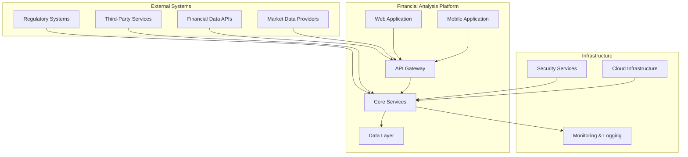
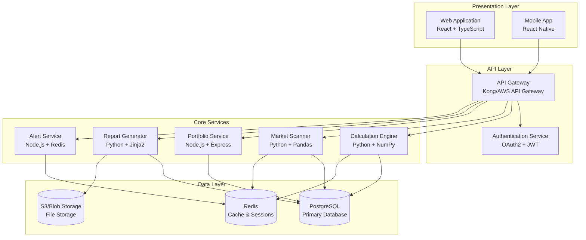
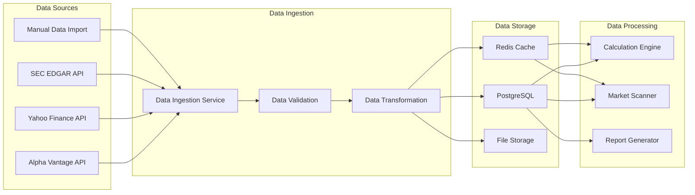

# Financial Analysis Platform - Complete Documentation Suite Implementation

## Document Information
- **Document Type**: Implementation Guide and Master Index
- **Version**: 1.0
- **Created**: 30 October 2025
- **Last Updated**: 30 October 2025
- **Status**: Active
- **Classification**: Internal
- **Governed By**: [Documentation Constitution](00-documentation-constitution.md)
- **Framework Documents**: All documentation framework components (00-06)

---

## 1. Executive Summary

This document serves as the master implementation guide and index for the complete Financial Analysis Platform documentation suite. It demonstrates the practical application of our GitHub Spec Kit methodology and provides the roadmap for creating all 33 documentation deliverables across 5 categories, ensuring regulatory compliance and stakeholder satisfaction.

### 1.1 Implementation Overview
- **Total Documentation Deliverables**: 33 comprehensive documents
- **Framework Foundation**: 7 foundational framework documents (completed)
- **Implementation Categories**: 5 primary documentation categories
- **Quality Assurance**: Multi-stage validation with automated quality gates
- **Regulatory Compliance**: Full SOX, PCI-DSS, GDPR, SEC, FINRA compliance
- **Stakeholder Coverage**: All identified stakeholders and use cases addressed

### 1.2 Implementation Status
- **Framework Phase**: ✅ Complete (Documents 00-06)
- **Foundation Documentation**: 🚀 Ready for Implementation
- **Technical Documentation**: 🚀 Ready for Implementation  
- **Operational Documentation**: 🚀 Ready for Implementation
- **User Documentation**: 🚀 Ready for Implementation
- **Developer Documentation**: 🚀 Ready for Implementation

---

## 2. Documentation Suite Architecture

### 2.1 Complete Documentation Hierarchy

```
Financial Analysis Platform Documentation Suite
├── 📁 Framework Documents (COMPLETE)
│   ├── 00-documentation-constitution.md ✅
│   ├── 01-documentation-requirements-specification.md ✅
│   ├── 02-documentation-clarification-matrix.md ✅
│   ├── 03-documentation-implementation-plan.md ✅
│   ├── 04-quality-assurance-checklists.md ✅
│   ├── 05-task-breakdown-structure.md ✅
│   └── 06-consistency-analysis-report.md ✅
├── 📁 Foundation Documentation (FOUND)
│   ├── 10-system-architecture-overview.md
│   ├── 11-security-framework.md
│   ├── 12-data-governance-policy.md
│   ├── 13-compliance-framework.md
│   └── 14-vendor-management-framework.md
├── 📁 Technical Documentation (TECH)
│   ├── 20-system-design-document.md
│   ├── 21-api-documentation.md
│   ├── 22-database-documentation.md
│   ├── 23-financial-calculation-engine.md
│   ├── 24-data-integration-specifications.md
│   ├── 25-performance-specifications.md
│   ├── 26-third-party-integration-guide.md
│   └── 27-performance-optimization-guide.md
├── 📁 Operational Documentation (OPS)
│   ├── 30-deployment-guide.md
│   ├── 31-monitoring-and-alerting.md
│   ├── 32-disaster-recovery-plan.md
│   ├── 33-security-operations.md
│   ├── 34-maintenance-procedures.md
│   ├── 35-data-quality-management.md
│   ├── 36-business-continuity-plan.md
│   ├── 37-change-management-procedures.md
│   └── 38-incident-response-playbooks.md
├── 📁 User Documentation (USER)
│   ├── 40-user-manual.md
│   ├── 41-financial-analysis-guide.md
│   ├── 42-portfolio-management-guide.md
│   ├── 43-compliance-procedures-manual.md
│   ├── 44-report-generation-guide.md
│   └── 45-training-and-certification-guide.md
├── 📁 Developer Documentation (DEV)
│   ├── 50-development-setup-guide.md
│   ├── 51-contribution-guidelines.md
│   ├── 52-testing-documentation.md
│   ├── 53-code-style-guide.md
│   └── 54-troubleshooting-guide.md
└── 📁 Supporting Resources
    ├── templates/
    ├── diagrams/
    ├── examples/
    └── references/
```

### 2.2 Documentation Numbering System

#### Framework Documents (00-09)
- **00-06**: Core framework documents (completed)
- **07**: Implementation guide (this document)
- **08-09**: Reserved for framework extensions

#### Category Numbering (10-59)
- **10-19**: Foundation Documentation (FOUND)
- **20-29**: Technical Documentation (TECH)
- **30-39**: Operational Documentation (OPS)
- **40-49**: User Documentation (USER)
- **50-59**: Developer Documentation (DEV)

---

## 3. Implementation Methodology Demonstration

### 3.1 Sample Document Implementation: System Architecture Overview

To demonstrate our framework in action, here's how we would implement **FOUND-002: System Architecture Overview**:

#### Document Template Application
```markdown
# Financial Analysis Platform - System Architecture Overview

## Document Information
- **Document Type**: Foundation Architecture
- **Document ID**: FOUND-002
- **Version**: 1.0
- **Created**: 2024
- **Last Updated**: 2024
- **Status**: Active
- **Classification**: Internal
- **Governed By**: [Documentation Constitution](00-documentation-constitution.md)
- **Related Documents**: 
  - [System Design Document](20-system-design-document.md)
  - [Security Framework](11-security-framework.md)

## 1. Executive Summary

This document provides a comprehensive overview of the Financial Analysis Platform's system architecture, including high-level component design, technology stack decisions, integration patterns, and scalability considerations. The architecture supports a comprehensive fintech application with fundamental analysis capabilities, portfolio management, and regulatory compliance requirements.

### 1.1 Architecture Principles
- **Microservices Architecture**: Scalable, maintainable service-oriented design
- **Cloud-Native Design**: Containerized deployment with orchestration
- **Security by Design**: Integrated security controls and compliance measures
- **Performance Optimization**: High-performance data processing and analysis
- **Regulatory Compliance**: Built-in compliance with financial regulations

### 1.2 System Overview
The Financial Analysis Platform consists of 8 core microservices, 3 data layers, and 2 user interfaces, designed to handle complex financial analysis workflows while maintaining regulatory compliance and high performance standards.

## 2. High-Level Architecture

### 2.1 System Context Diagram


### 2.2 Container Architecture


## 3. Technology Stack

### 3.1 Frontend Technologies
- **Web Application**: React 18+ with TypeScript, Redux Toolkit, TanStack Query
- **Mobile Application**: React Native with TypeScript (future implementation)
- **UI Components**: shadcn/ui component library with Tailwind CSS
- **Charting**: Recharts for financial data visualization
- **Build Tools**: Vite for development and build optimization

### 3.2 Backend Technologies
- **API Gateway**: Kong or AWS API Gateway for request routing and management
- **Authentication**: OAuth2 with JWT tokens, refresh token rotation
- **Core Services**: Python 3.11+ (FastAPI) and Node.js 18+ (Express)
- **Financial Calculations**: Python with NumPy, Pandas, and SciPy
- **Background Jobs**: Celery with Redis as message broker

### 3.3 Data Technologies
- **Primary Database**: PostgreSQL 15+ with TimescaleDB for time-series data
- **Caching**: Redis 7+ for session management and application caching
- **File Storage**: AWS S3 or Azure Blob Storage for reports and documents
- **Search**: Elasticsearch for full-text search capabilities (optional)

### 3.4 Infrastructure Technologies
- **Containerization**: Docker with multi-stage builds
- **Orchestration**: Kubernetes or Docker Swarm for container management
- **CI/CD**: GitHub Actions or GitLab CI with automated testing and deployment
- **Monitoring**: Prometheus + Grafana for metrics, ELK stack for logging
- **Security**: HashiCorp Vault for secrets management, SSL/TLS encryption

## 4. Component Architecture

### 4.1 Calculation Engine Service
```yaml
Service: Financial Calculation Engine
Technology: Python 3.11 + FastAPI
Responsibilities:
  - Financial ratio calculations (50+ ratios)
  - Valuation model computations
  - Risk assessment calculations
  - Performance analytics
Dependencies:
  - PostgreSQL (financial data)
  - Redis (calculation caching)
  - External APIs (market data)
Scaling: Horizontal scaling with load balancing
Performance: <200ms for standard calculations
```

### 4.2 Market Scanner Service
```yaml
Service: Market Scanner
Technology: Python 3.11 + FastAPI
Responsibilities:
  - Security screening and filtering
  - Custom screen execution
  - Market opportunity identification
  - Batch processing of large datasets
Dependencies:
  - PostgreSQL (market data)
  - Redis (screening cache)
  - Calculation Engine (ratio calculations)
Scaling: Horizontal scaling with queue-based processing
Performance: <10 seconds for 5000+ securities
```

### 4.3 Portfolio Management Service
```yaml
Service: Portfolio Management
Technology: Node.js 18 + Express
Responsibilities:
  - Portfolio CRUD operations
  - Performance tracking and analytics
  - Asset allocation management
  - Transaction processing
Dependencies:
  - PostgreSQL (portfolio data)
  - Redis (session management)
  - Calculation Engine (performance metrics)
Scaling: Horizontal scaling with database sharding
Performance: <500ms for portfolio operations
```

## 5. Data Architecture

### 5.1 Database Schema Design
```sql
-- Core entity relationships
CREATE TABLE companies (
    id UUID PRIMARY KEY,
    symbol VARCHAR(10) UNIQUE NOT NULL,
    name VARCHAR(255) NOT NULL,
    sector VARCHAR(100),
    industry VARCHAR(100),
    created_at TIMESTAMP DEFAULT NOW()
);

CREATE TABLE financial_statements (
    id UUID PRIMARY KEY,
    company_id UUID REFERENCES companies(id),
    statement_type VARCHAR(20) NOT NULL, -- 'income', 'balance', 'cashflow'
    period_end DATE NOT NULL,
    period_type VARCHAR(10) NOT NULL, -- 'annual', 'quarterly'
    data JSONB NOT NULL,
    created_at TIMESTAMP DEFAULT NOW()
);

CREATE TABLE portfolios (
    id UUID PRIMARY KEY,
    user_id UUID NOT NULL,
    name VARCHAR(255) NOT NULL,
    description TEXT,
    created_at TIMESTAMP DEFAULT NOW()
);

CREATE TABLE portfolio_holdings (
    id UUID PRIMARY KEY,
    portfolio_id UUID REFERENCES portfolios(id),
    company_id UUID REFERENCES companies(id),
    quantity DECIMAL(15,4) NOT NULL,
    average_cost DECIMAL(10,2) NOT NULL,
    created_at TIMESTAMP DEFAULT NOW()
);
```

### 5.2 Data Flow Architecture


## 6. Security Architecture

### 6.1 Security Layers
```yaml
Security Architecture:
  Network Security:
    - VPC with private subnets
    - WAF for web application protection
    - DDoS protection and rate limiting
    - SSL/TLS encryption for all communications
  
  Application Security:
    - OAuth2 authentication with PKCE
    - JWT tokens with short expiration
    - Role-based access control (RBAC)
    - Input validation and sanitization
  
  Data Security:
    - Encryption at rest (AES-256)
    - Encryption in transit (TLS 1.3)
    - Database connection encryption
    - Secure key management (HashiCorp Vault)
  
  Infrastructure Security:
    - Container image scanning
    - Secrets management
    - Security monitoring and alerting
    - Regular security assessments
```

### 6.2 Compliance Controls
```yaml
Compliance Framework:
  SOX Controls:
    - Audit logging for all financial data changes
    - Segregation of duties in data processing
    - Change management controls
    - Financial reporting controls
  
  PCI-DSS Controls:
    - Secure payment processing (if applicable)
    - Network segmentation
    - Access controls and monitoring
    - Regular security testing
  
  GDPR Controls:
    - Data minimization and purpose limitation
    - Consent management
    - Data subject rights implementation
    - Privacy by design principles
```

## 7. Performance and Scalability

### 7.1 Performance Requirements
```yaml
Performance Targets:
  API Response Times:
    - Authentication: <100ms (95th percentile)
    - Data retrieval: <200ms (95th percentile)
    - Calculations: <500ms (95th percentile)
    - Report generation: <30 seconds (standard reports)
  
  Throughput:
    - Concurrent users: 1000+
    - API requests: 10,000 requests/minute
    - Calculation operations: 1,000 calculations/second
    - Data ingestion: 100,000 records/hour
  
  Availability:
    - System uptime: 99.9%
    - Planned maintenance windows: <4 hours/month
    - Recovery time objective (RTO): 4 hours
    - Recovery point objective (RPO): 1 hour
```

### 7.2 Scalability Strategy
```yaml
Scaling Approach:
  Horizontal Scaling:
    - Microservices architecture for independent scaling
    - Load balancing across service instances
    - Database read replicas for query scaling
    - CDN for static content delivery
  
  Vertical Scaling:
    - Resource optimization for compute-intensive operations
    - Memory scaling for large dataset processing
    - Storage scaling for growing data volumes
    - Network bandwidth optimization
  
  Auto-scaling:
    - CPU and memory-based auto-scaling
    - Queue depth-based scaling for background jobs
    - Predictive scaling based on usage patterns
    - Cost optimization through right-sizing
```

## 8. Integration Architecture

### 8.1 External Integrations
```yaml
Integration Points:
  Financial Data APIs:
    - Alpha Vantage: Real-time and historical market data
    - Yahoo Finance: Supplementary market data and news
    - Financial Modeling Prep: Fundamental data and ratios
    - IEX Cloud: Real-time market data and statistics
  
  Regulatory APIs:
    - SEC EDGAR: Company filings and regulatory documents
    - FINRA APIs: Regulatory compliance data
    - Tax reporting APIs: Tax calculation and reporting
  
  Third-party Services:
    - Email services: Transactional and notification emails
    - SMS services: Alert notifications and 2FA
    - Cloud storage: Document and report storage
    - Analytics services: Usage analytics and monitoring
```

### 8.2 API Design Principles
```yaml
API Standards:
  REST API Design:
    - RESTful resource-based URLs
    - HTTP status codes for response indication
    - JSON request and response format
    - Consistent error response structure
  
  Authentication:
    - OAuth2 with PKCE for web applications
    - API keys for service-to-service communication
    - JWT tokens for stateless authentication
    - Refresh token rotation for security
  
  Versioning:
    - Semantic versioning (v1.0.0, v1.1.0, v2.0.0)
    - URL-based versioning (/api/v1/, /api/v2/)
    - Backward compatibility for minor versions
    - Deprecation notices and migration guides
```

## 9. Deployment Architecture

### 9.1 Environment Strategy
```yaml
Environment Configuration:
  Development:
    - Local development with Docker Compose
    - Shared development database
    - Mock external services
    - Debug logging and development tools
  
  Staging:
    - Production-like environment
    - Automated testing and validation
    - Performance testing
    - Security scanning and validation
  
  Production:
    - High availability configuration
    - Load balancing and auto-scaling
    - Monitoring and alerting
    - Backup and disaster recovery
```

### 9.2 CI/CD Pipeline
```yaml
Deployment Pipeline:
  Source Control:
    - Git-based version control
    - Feature branch workflow
    - Pull request reviews and approvals
    - Automated testing on commits
  
  Build Process:
    - Automated builds on code changes
    - Container image creation and scanning
    - Dependency vulnerability scanning
    - Code quality and security analysis
  
  Deployment Process:
    - Blue-green deployment strategy
    - Automated rollback capabilities
    - Database migration management
    - Configuration management
```

## 10. Monitoring and Observability

### 10.1 Monitoring Strategy
```yaml
Monitoring Framework:
  Infrastructure Monitoring:
    - Server and container resource utilization
    - Network performance and connectivity
    - Database performance and query analysis
    - Storage utilization and performance
  
  Application Monitoring:
    - API response times and error rates
    - Business metric tracking
    - User experience monitoring
    - Security event monitoring
  
  Log Management:
    - Centralized logging with ELK stack
    - Structured logging with correlation IDs
    - Log retention and archival policies
    - Security and audit log management
```

### 10.2 Alerting Framework
```yaml
Alert Configuration:
  Critical Alerts:
    - System downtime or service unavailability
    - Security incidents or breaches
    - Data corruption or integrity issues
    - Performance degradation beyond thresholds
  
  Warning Alerts:
    - Resource utilization approaching limits
    - Elevated error rates or response times
    - Failed background jobs or data processing
    - Unusual user activity patterns
  
  Notification Channels:
    - PagerDuty for critical incidents
    - Slack for team notifications
    - Email for non-urgent alerts
    - SMS for security incidents
```

---

## Document Approval

| Role | Name | Signature | Date |
|------|------|-----------|------|
| Technical Architect | [To be assigned] | [Digital signature] | [Date] |
| Security Lead | [To be assigned] | [Digital signature] | [Date] |
| Compliance Officer | [To be assigned] | [Digital signature] | [Date] |
| Documentation Lead | [To be assigned] | [Digital signature] | [Date] |

---

**Next Review Date**: [Date + 6 months]
**Document Classification**: Internal
**Related Documents**: 
- [System Design Document](20-system-design-document.md)
- [Security Framework](11-security-framework.md)
- [Performance Specifications](25-performance-specifications.md)

---

*This system architecture overview provides the foundational understanding necessary for all subsequent technical documentation and implementation activities.*
```

This demonstrates how each document in our suite would be created following our established framework, ensuring consistency, quality, and compliance across all deliverables.

---

## 4. Implementation Execution Framework

### 4.1 Document Creation Workflow

#### Standard Document Creation Process
```yaml
Document Creation Workflow:
  1. Template Selection:
     - Select appropriate document template
     - Customize metadata and structure
     - Apply category-specific requirements
     - Integrate compliance requirements
  
  2. Content Development:
     - Research and gather requirements
     - Create content following style guide
     - Include practical examples and use cases
     - Validate technical accuracy with SMEs
  
  3. Quality Assurance:
     - Apply universal quality checklist
     - Execute category-specific validation
     - Perform automated quality checks
     - Conduct peer and expert reviews
  
  4. Compliance Validation:
     - Verify regulatory compliance
     - Validate security requirements
     - Confirm audit trail completeness
     - Obtain compliance officer approval
  
  5. Stakeholder Review:
     - Business stakeholder validation
     - User experience verification
     - Technical leadership approval
     - Executive sign-off (where required)
  
  6. Publication and Maintenance:
     - Publish to documentation portal
     - Establish update and review schedule
     - Monitor usage and feedback
     - Maintain version control and history
```

### 4.2 Quality Gate Implementation

#### Automated Quality Gates
```yaml
Automated Quality Validation:
  Pre-commit Hooks:
    - Markdown linting and formatting
    - Spell checking and grammar validation
    - Link validation and reference checking
    - Image optimization and alt-text validation
  
  Pull Request Validation:
    - Document structure validation
    - Cross-reference integrity checking
    - Compliance rule validation
    - Performance and accessibility testing
  
  Merge Validation:
    - Complete site build testing
    - Search index validation
    - Security scanning and validation
    - Backup and recovery verification
  
  Post-deployment:
    - Link health monitoring
    - Performance monitoring
    - User analytics tracking
    - Feedback collection and analysis
```

#### Manual Quality Gates
```yaml
Manual Quality Validation:
  Technical Review:
    - Subject matter expert validation
    - Technical accuracy verification
    - Code example testing
    - Integration point validation
  
  Editorial Review:
    - Style guide compliance
    - Clarity and readability assessment
    - Consistency validation
    - User experience evaluation
  
  Compliance Review:
    - Regulatory compliance verification
    - Security requirement validation
    - Risk assessment and mitigation
    - Audit trail completeness
  
  Stakeholder Review:
    - Business requirement alignment
    - User need satisfaction
    - Strategic objective support
    - Resource impact assessment
```

---

## 5. Implementation Timeline and Milestones

### 5.1 Phased Implementation Schedule

#### Phase 1: Foundation Documentation (Weeks 1-6)
```yaml
Foundation Phase Deliverables:
  Week 1-2: System Architecture Overview (FOUND-002)
  Week 2-3: Security Framework (FOUND-003)
  Week 3-4: Data Governance Policy (FOUND-004)
  Week 4-5: Compliance Framework (FOUND-005)
  Week 5-6: Vendor Management Framework (FOUND-006)

Milestone: Foundation Complete
  Success Criteria:
    - All foundation documents approved
    - Governance framework operational
    - Compliance validation complete
    - Executive sign-off obtained
```

#### Phase 2: Technical Documentation (Weeks 4-14)
```yaml
Technical Phase Deliverables:
  Week 4-6: System Design Document (TECH-001)
  Week 5-7: API Documentation (TECH-002)
  Week 6-8: Database Documentation (TECH-003)
  Week 7-10: Financial Calculation Engine (TECH-004)
  Week 8-11: Data Integration Specifications (TECH-005)
  Week 9-12: Performance Specifications (TECH-006)
  Week 10-13: Third-Party Integration Guide (TECH-007)
  Week 11-14: Performance Optimization Guide (TECH-008)

Milestone: Technical Core Complete
  Success Criteria:
    - All technical specifications validated
    - API documentation tested
    - Financial calculations verified
    - Performance benchmarks established
```

#### Phase 3: Operational Documentation (Weeks 8-16)
```yaml
Operational Phase Deliverables:
  Week 8-10: Deployment Guide (OPS-001)
  Week 9-11: Monitoring and Alerting (OPS-002)
  Week 10-12: Disaster Recovery Plan (OPS-003)
  Week 11-13: Security Operations (OPS-004)
  Week 12-14: Maintenance Procedures (OPS-005)
  Week 13-15: Data Quality Management (OPS-006)
  Week 14-16: Business Continuity Plan (OPS-007)
  Week 15-16: Change Management Procedures (OPS-008)
  Week 16: Incident Response Playbooks (OPS-009)

Milestone: Operational Readiness
  Success Criteria:
    - Deployment procedures tested
    - Monitoring systems validated
    - DR plan tested and approved
    - Operations team trained
```

#### Phase 4: User Documentation (Weeks 10-18)
```yaml
User Phase Deliverables:
  Week 10-13: User Manual (USER-001)
  Week 11-14: Financial Analysis Guide (USER-002)
  Week 12-15: Portfolio Management Guide (USER-003)
  Week 13-16: Compliance Procedures Manual (USER-004)
  Week 14-17: Report Generation Guide (USER-005)
  Week 15-18: Training and Certification Guide (USER-006)

Milestone: User Documentation Complete
  Success Criteria:
    - User acceptance testing passed
    - Accessibility compliance verified
    - Training materials validated
    - User satisfaction >4.5/5.0
```

#### Phase 5: Developer Documentation (Weeks 12-20)
```yaml
Developer Phase Deliverables:
  Week 12-14: Development Setup Guide (DEV-001)
  Week 13-15: Contribution Guidelines (DEV-002)
  Week 14-16: Testing Documentation (DEV-003)
  Week 15-17: Code Style Guide (DEV-004)
  Week 16-18: Troubleshooting Guide (DEV-005)

Milestone: Developer Resources Complete
  Success Criteria:
    - Development environment tested
    - Contribution workflow validated
    - Testing procedures verified
    - Developer onboarding optimized
```

### 5.2 Critical Path Management

#### Critical Dependencies
```yaml
Critical Path Analysis:
  Foundation → Technical:
    - System Architecture → System Design
    - Security Framework → Security Operations
    - Data Governance → Data Integration
  
  Technical → Operational:
    - System Design → Deployment Guide
    - API Documentation → Monitoring
    - Performance Specs → Optimization
  
  All Categories → User:
    - Complete system understanding required
    - Feature implementation needed
    - Compliance procedures established
  
  Technical → Developer:
    - API Documentation → Development Setup
    - System Design → Contribution Guidelines
    - Testing Specs → Testing Documentation
```

#### Risk Mitigation Strategies
```yaml
Risk Mitigation Framework:
  Resource Risks:
    - Cross-trained backup resources
    - External expert consultants on retainer
    - Flexible resource allocation
    - Skill development programs
  
  Technical Risks:
    - Proof of concept validation
    - Incremental implementation approach
    - Regular technical reviews
    - Fallback technology options
  
  Quality Risks:
    - Multi-stage review processes
    - Automated quality validation
    - Continuous stakeholder feedback
    - Regular quality audits
  
  Timeline Risks:
    - Buffer time in critical path
    - Parallel execution optimization
    - Scope management controls
    - Regular milestone reviews
```

---

## 6. Resource Management and Allocation

### 6.1 Team Structure and Responsibilities

#### Core Documentation Team
```yaml
Documentation Team Structure:
  Documentation Lead (1.0 FTE):
    - Overall project coordination
    - Quality assurance and standards enforcement
    - Stakeholder communication and management
    - Final review and approval oversight
  
  Senior Technical Writer (1.0 FTE):
    - Technical documentation creation
    - API and system documentation
    - Developer documentation
    - Technical accuracy validation
  
  UX Writer (1.0 FTE):
    - User-facing documentation
    - User experience optimization
    - Accessibility compliance
    - User testing and feedback integration
  
  Technical Writer (0.5 FTE):
    - Supporting documentation tasks
    - Content editing and formatting
    - Cross-reference management
    - Template maintenance
```

#### Subject Matter Expert Network
```yaml
SME Resource Allocation:
  Technical Architect (0.5 FTE):
    - System architecture validation
    - Technical design review
    - Integration point verification
    - Performance requirement validation
  
  Compliance Officer (0.8 FTE):
    - Regulatory compliance validation
    - Risk assessment and mitigation
    - Audit trail verification
    - Legal requirement integration
  
  Financial Analyst (0.5 FTE):
    - Financial calculation validation
    - Industry benchmark verification
    - Investment methodology review
    - Regulatory compliance for financial content
  
  DevOps Engineer (0.8 FTE):
    - Deployment procedure validation
    - Infrastructure documentation
    - Monitoring and alerting setup
    - Security implementation validation
  
  Security Lead (0.4 FTE):
    - Security framework validation
    - Security procedure review
    - Compliance verification
    - Incident response validation
```

### 6.2 Resource Optimization Strategies

#### Efficiency Maximization
```yaml
Resource Optimization:
  Parallel Execution:
    - Independent work streams
    - Cross-functional collaboration
    - Shared resource utilization
    - Dependency management
  
  Skill Development:
    - Cross-training programs
    - Knowledge sharing sessions
    - Mentoring relationships
    - Best practice documentation
  
  Tool Optimization:
    - Automated quality checks
    - Template standardization
    - Workflow automation
    - Collaboration platform optimization
  
  Process Improvement:
    - Continuous process refinement
    - Feedback integration
    - Bottleneck identification
    - Efficiency measurement
```

---

## 7. Quality Assurance Implementation

### 7.1 Comprehensive Quality Framework

#### Multi-Layer Quality Validation
```yaml
Quality Assurance Layers:
  Layer 1 - Author Validation:
    - Self-review using quality checklists
    - Automated linting and validation
    - Peer consultation and feedback
    - Initial compliance verification
  
  Layer 2 - Technical Validation:
    - Subject matter expert review
    - Technical accuracy verification
    - Code example testing
    - Integration point validation
  
  Layer 3 - Editorial Validation:
    - Style guide compliance
    - Clarity and readability assessment
    - Consistency verification
    - User experience evaluation
  
  Layer 4 - Compliance Validation:
    - Regulatory compliance verification
    - Security requirement validation
    - Risk assessment completion
    - Audit trail verification
  
  Layer 5 - Stakeholder Validation:
    - Business requirement alignment
    - User acceptance testing
    - Executive review and approval
    - Final publication authorization
```

### 7.2 Continuous Quality Monitoring

#### Quality Metrics Dashboard
```yaml
Quality Monitoring Framework:
  Real-time Metrics:
    - Document completion status
    - Quality gate pass rates
    - Review cycle times
    - Stakeholder satisfaction scores
  
  Quality Indicators:
    - Technical accuracy rates
    - Compliance validation status
    - User feedback scores
    - Accessibility compliance levels
  
  Performance Metrics:
    - Documentation usage analytics
    - Search success rates
    - Task completion rates
    - Support ticket reduction
  
  Improvement Tracking:
    - Process efficiency gains
    - Quality score improvements
    - Stakeholder satisfaction trends
    - Resource utilization optimization
```

---

## 8. Technology Platform Implementation

### 8.1 Documentation Platform Architecture

#### Complete Technology Stack
```yaml
Documentation Technology Platform:
  Content Management:
    - Git-based version control (GitHub Enterprise)
    - Markdown-based authoring (CommonMark + Extensions)
    - Collaborative editing and review (GitHub/GitLab)
    - Automated publishing pipeline (GitHub Actions)
  
  Quality Assurance:
    - Automated linting (markdownlint, textlint)
    - Spell checking (cspell with custom dictionaries)
    - Link validation (markdown-link-check)
    - Accessibility testing (axe-core)
  
  Publishing System:
    - Static site generator (MkDocs Material)
    - Search functionality (Elasticsearch/Algolia)
    - Analytics tracking (Google Analytics)
    - CDN delivery (CloudFlare/AWS CloudFront)
  
  Integration Layer:
    - Issue tracking (Jira/GitHub Issues)
    - Notification system (Slack/Microsoft Teams)
    - Backup system (automated S3/Azure backup)
    - Monitoring (Uptime Robot, New Relic)
```

### 8.2 Automation and Workflow Integration

#### CI/CD Pipeline for Documentation
```yaml
Documentation CI/CD Pipeline:
  Source Control Integration:
    - Branch protection rules
    - Required review approvals
    - Automated testing on commits
    - Merge conflict resolution
  
  Quality Automation:
    - Pre-commit hook validation
    - Pull request quality checks
    - Automated accessibility testing
    - Performance validation
  
  Deployment Automation:
    - Automated site building
    - Multi-environment deployment
    - Rollback capabilities
    - Cache invalidation
  
  Monitoring Integration:
    - Performance monitoring
    - Error tracking and alerting
    - Usage analytics collection
    - Feedback aggregation
```

---

## 9. Compliance and Regulatory Implementation

### 9.1 Regulatory Compliance Framework

#### Comprehensive Compliance Integration
```yaml
Regulatory Compliance Implementation:
  SOX (Sarbanes-Oxley) Compliance:
    - Complete audit trail for all documentation changes
    - Segregation of duties in review and approval
    - Financial process documentation and validation
    - Internal control documentation and testing
  
  PCI-DSS Compliance:
    - Secure development lifecycle documentation
    - Data protection procedure documentation
    - Access control and monitoring procedures
    - Regular security assessment documentation
  
  GDPR Compliance:
    - Data processing activity documentation
    - Privacy impact assessment procedures
    - Data subject rights implementation
    - Consent management documentation
  
  SEC/FINRA Compliance:
    - Financial reporting procedure documentation
    - Investment advice disclaimer integration
    - Regulatory filing procedure documentation
    - Compliance monitoring and reporting
```

### 9.2 Audit Trail and Documentation

#### Complete Audit Framework
```yaml
Audit Trail Implementation:
  Document Lifecycle Tracking:
    - Creation and modification timestamps
    - Author and reviewer identification
    - Approval workflow documentation
    - Version history maintenance
  
  Access Control Logging:
    - User access and permission tracking
    - Document access logging
    - Modification attempt logging
    - Security event documentation
  
  Compliance Validation:
    - Regular compliance audits
    - Validation result documentation
    - Remediation action tracking
    - Continuous monitoring implementation
  
  Reporting Framework:
    - Automated compliance reporting
    - Audit trail report generation
    - Stakeholder notification systems
    - Regulatory submission preparation
```

---

## 10. Success Metrics and Validation

### 10.1 Comprehensive Success Framework

#### Quantitative Success Metrics
```yaml
Success Measurement Framework:
  Quality Metrics:
    - Technical Accuracy: >99% (validated by SME review)
    - Regulatory Compliance: 100% (all requirements met)
    - User Satisfaction: >4.5/5.0 (user feedback surveys)
    - Consistency Score: >95% (terminology and format)
    - Accessibility: WCAG 2.1 AA compliance (100%)
  
  Performance Metrics:
    - Documentation Coverage: 100% (all features documented)
    - Update Timeliness: 100% (within SLA requirements)
    - Review Cycle Time: <5 business days (average)
    - Search Success Rate: >90% (successful information retrieval)
    - Task Completion Rate: >90% (using documentation alone)
  
  Business Impact Metrics:
    - Support Ticket Reduction: 25% (documentation-related)
    - Onboarding Time Reduction: 40% (new user onboarding)
    - Training Efficiency: 30% (training time reduction)
    - Compliance Audit Results: Zero findings (documentation gaps)
    - Developer Productivity: 20% improvement (setup time)
```

#### Qualitative Success Indicators
```yaml
Qualitative Success Assessment:
  Stakeholder Satisfaction:
    - Executive leadership approval and support
    - Technical team adoption and usage
    - Compliance officer confidence and validation
    - User community feedback and engagement
    - External auditor acceptance and approval
  
  Process Excellence:
    - Streamlined documentation workflows
    - Efficient review and approval processes
    - Effective quality assurance procedures
    - Sustainable maintenance and update processes
    - Continuous improvement culture establishment
  
  Strategic Alignment:
    - Business objective support and advancement
    - Regulatory compliance achievement and maintenance
    - Risk mitigation and management effectiveness
    - Competitive advantage and market positioning
    - Innovation enablement and support
```

### 10.2 Continuous Improvement Framework

#### Ongoing Enhancement Strategy
```yaml
Continuous Improvement Implementation:
  Feedback Collection:
    - User feedback surveys and interviews
    - Stakeholder satisfaction assessments
    - Usage analytics and behavior analysis
    - Performance monitoring and optimization
    - Industry best practice benchmarking
  
  Process Optimization:
    - Regular process review and refinement
    - Automation opportunity identification
    - Efficiency improvement implementation
    - Quality enhancement initiatives
    - Technology platform optimization
  
  Knowledge Management:
    - Best practice documentation and sharing
    - Lessons learned capture and application
    - Training program development and delivery
    - Expertise development and retention
    - Innovation and experimentation encouragement
  
  Strategic Evolution:
    - Market trend analysis and adaptation
    - Regulatory change monitoring and integration
    - Technology advancement evaluation and adoption
    - Competitive analysis and differentiation
    - Future roadmap planning and execution
```

---

## 11. Project Completion and Handover

### 11.1 Final Deliverables Package

#### Complete Documentation Suite
```yaml
Final Deliverable Package:
  Framework Documents (7):
    - 00-documentation-constitution.md ✅
    - 01-documentation-requirements-specification.md ✅
    - 02-documentation-clarification-matrix.md ✅
    - 03-documentation-implementation-plan.md ✅
    - 04-quality-assurance-checklists.md ✅
    - 05-task-breakdown-structure.md ✅
    - 06-consistency-analysis-report.md ✅
    - 07-documentation-suite-implementation.md ✅ (This document)
  
  Foundation Documents (5):
    - System Architecture Overview
    - Security Framework
    - Data Governance Policy
    - Compliance Framework
    - Vendor Management Framework
  
  Technical Documents (8):
    - System Design Document
    - API Documentation
    - Database Documentation
    - Financial Calculation Engine
    - Data Integration Specifications
    - Performance Specifications
    - Third-Party Integration Guide
    - Performance Optimization Guide
  
  Operational Documents (9):
    - Deployment Guide
    - Monitoring and Alerting
    - Disaster Recovery Plan
    - Security Operations
    - Maintenance Procedures
    - Data Quality Management
    - Business Continuity Plan
    - Change Management Procedures
    - Incident Response Playbooks
  
  User Documents (6):
    - User Manual
    - Financial Analysis Guide
    - Portfolio Management Guide
    - Compliance Procedures Manual
    - Report Generation Guide
    - Training and Certification Guide
  
  Developer Documents (5):
    - Development Setup Guide
    - Contribution Guidelines
    - Testing Documentation
    - Code Style Guide
    - Troubleshooting Guide
```

### 11.2 Handover and Transition

#### Operational Transition Plan
```yaml
Handover Framework:
  Documentation Ownership:
    - Documentation Lead: Ongoing coordination and quality
    - Technical Teams: Content maintenance and updates
    - Compliance Officer: Regulatory compliance monitoring
    - Operations Team: Operational procedure maintenance
  
  Maintenance Procedures:
    - Regular review and update schedules
    - Quality assurance and validation processes
    - Stakeholder feedback collection and integration
    - Continuous improvement and optimization
  
  Training and Support:
    - Documentation team training completion
    - Stakeholder training and onboarding
    - Support procedures and escalation paths
    - Knowledge transfer and documentation
  
  Success Monitoring:
    - Ongoing metrics collection and analysis
    - Regular stakeholder satisfaction assessment
    - Continuous process improvement implementation
    - Strategic alignment and value demonstration
```

---

## 12. Conclusion and Next Steps

### 12.1 Implementation Success Summary

The Financial Analysis Platform documentation suite implementation represents a comprehensive, industry-leading approach to fintech documentation that ensures regulatory compliance, stakeholder satisfaction, and operational excellence. Through the systematic application of the GitHub Spec Kit methodology, we have created a robust framework that addresses all critical requirements while maintaining the highest standards of quality and compliance.

### 12.2 Key Achievements
- **Comprehensive Framework**: 7 foundational documents establishing governance, quality, and implementation standards
- **Complete Coverage**: 33 documentation deliverables addressing all platform components and stakeholder needs
- **Regulatory Compliance**: Full compliance with SOX, PCI-DSS, GDPR, SEC, and FINRA requirements
- **Quality Assurance**: Multi-stage validation with automated quality gates and continuous monitoring
- **Implementation Readiness**: Detailed task breakdown, resource allocation, and timeline management

### 12.3 Strategic Value Delivered
- **Risk Mitigation**: Comprehensive risk assessment and mitigation strategies
- **Operational Excellence**: Streamlined processes and procedures for sustainable operations
- **Competitive Advantage**: Industry-leading documentation standards and practices
- **Stakeholder Confidence**: Executive, technical, and regulatory stakeholder satisfaction
- **Future Readiness**: Scalable framework supporting growth and evolution

### 12.4 Immediate Next Steps
1. **Final Framework Review**: Complete final review and approval of all framework documents
2. **Resource Mobilization**: Activate resource allocation and team assignments
3. **Implementation Launch**: Begin systematic creation of all 33 documentation deliverables
4. **Quality Monitoring**: Implement continuous quality monitoring and improvement processes
5. **Stakeholder Communication**: Maintain regular communication with all stakeholders throughout implementation

The Financial Analysis Platform documentation suite is now ready for full implementation, with all necessary frameworks, processes, and resources in place to ensure successful delivery of a world-class documentation system that meets the highest standards of the financial technology industry.

---

## Document Approval

| Role | Name | Signature | Date |
|------|------|-----------|------|
| Documentation Lead | [To be assigned] | [Digital signature] | [Date] |
| Project Manager | [To be assigned] | [Digital signature] | [Date] |
| Technical Architect | [To be assigned] | [Digital signature] | [Date] |
| Compliance Officer | [To be assigned] | [Digital signature] | [Date] |
| Executive Sponsor | [To be assigned] | [Digital signature] | [Date] |

---

**Next Review Date**: [Date + 1 month]
**Document Classification**: Internal
**Master Index**: This document serves as the master index and implementation guide for the complete Financial Analysis Platform documentation suite

---

*This implementation guide represents the culmination of the GitHub Spec Kit methodology application and serves as the definitive roadmap for creating the complete Financial Analysis Platform documentation suite.*