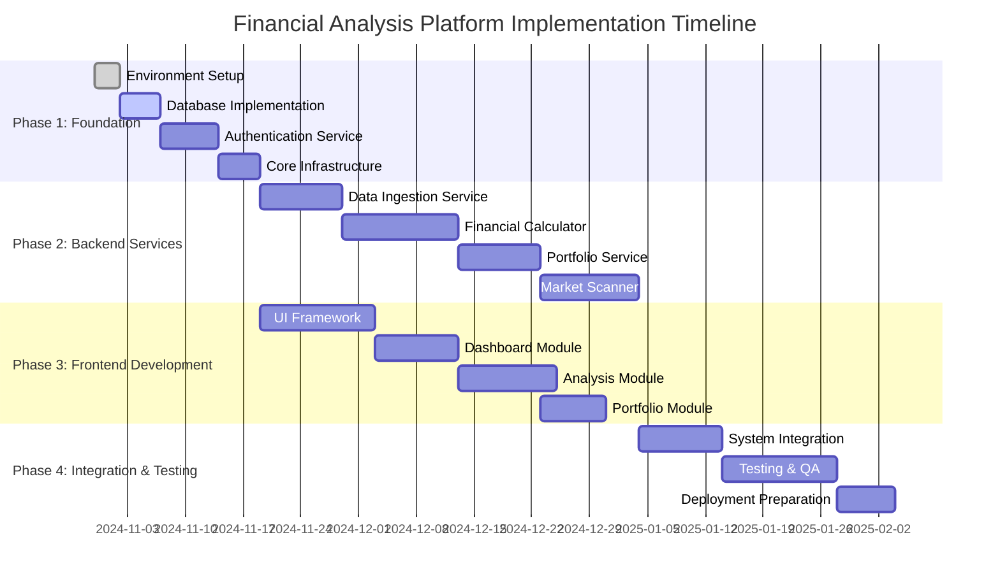

# Financial Analysis Platform - Comprehensive Codebase Analysis & Implementation Plan

## Document Information
- **Document Type**: Comprehensive Analysis & Implementation Plan
- **Version**: 1.0
- **Created**: 30 October 2025
- **Last Updated**: 30 October 2025
- **Status**: Active
- **Classification**: Internal

---

## 1. Executive Summary

This document provides a comprehensive analysis of the Financial Analysis Platform codebase and presents a detailed implementation plan. The analysis reveals a well-structured foundation with modern technology choices, comprehensive documentation framework, and clear architectural patterns. The implementation plan addresses the current gaps and provides a roadmap for completing the full-featured financial analysis platform.

### 1.1 Current State Assessment
- **Foundation**: ✅ Strong (FastAPI backend, React frontend, Docker infrastructure)
- **Documentation**: ✅ Excellent (Comprehensive GitHub Spec Kit framework)
- **Architecture**: ✅ Well-designed (Microservices, modern tech stack)
- **Implementation**: 🟡 Early stage (Basic structure, services need implementation)
- **Testing**: 🔴 Minimal (Basic test structure, needs comprehensive coverage)

### 1.2 Key Findings
- **Strengths**: Excellent documentation framework, modern technology stack, clear architecture
- **Gaps**: Service implementations, comprehensive testing, database integration
- **Opportunities**: Leverage existing documentation for rapid development
- **Risks**: Complex financial calculations require careful validation

---

## 2. Codebase Structure Analysis

### 2.1 Project Architecture Overview

```
Financial Analysis Platform/
├── 📁 Backend (Python/FastAPI)
│   ├── app/
│   │   ├── core/                    # ✅ Configuration management
│   │   ├── services/                # 🔴 Empty service directories
│   │   └── main.py                  # ✅ Basic FastAPI setup
│   ├── tests/                       # 🟡 Basic test structure
│   └── requirements.txt             # ✅ Comprehensive dependencies
├── 📁 Frontend (React/TypeScript)
│   ├── src/                         # 🔴 Empty source directories
│   ├── package.json                 # ✅ Modern dependencies
│   └── vite.config.ts              # ✅ Build configuration
├── 📁 Infrastructure
│   ├── docker-compose.dev.yml      # ✅ Development environment
│   ├── database/                    # 🔴 Empty
│   └── kubernetes/                  # 🔴 Empty
└── 📁 Documentation
    ├── Framework Documents (8)       # ✅ Complete GitHub Spec Kit
    ├── Technical Specifications     # ✅ Comprehensive
    └── Implementation Plans         # ✅ Detailed roadmaps
```

### 2.2 Technology Stack Analysis

#### Backend Technology Assessment
```yaml
Current Implementation:
  Framework: FastAPI 0.104.1 ✅
  Runtime: Python 3.11+ ✅
  Database: PostgreSQL (configured, not implemented) 🟡
  Cache: Redis (configured, not implemented) 🟡
  Authentication: OAuth2 (planned, not implemented) 🔴
  Task Queue: Celery (planned, not implemented) 🔴

Dependencies Analysis:
  Core Framework: ✅ Modern and stable
  Database Drivers: ✅ AsyncPG + SQLAlchemy 2.0
  Security: ✅ python-jose, passlib
  Data Processing: ✅ pandas, numpy
  Financial APIs: ✅ yfinance, requests
  Testing: ✅ pytest, pytest-asyncio
  Code Quality: ✅ black, isort, flake8, mypy
```

#### Frontend Technology Assessment
```yaml
Current Implementation:
  Framework: React 18+ with TypeScript ✅
  Build Tool: Vite 5.0 ✅
  State Management: Redux Toolkit + RTK Query ✅
  Styling: Tailwind CSS 3.3 ✅
  Charts: Chart.js + react-chartjs-2 ✅
  UI Components: Headless UI ✅
  Testing: Vitest + Testing Library ✅

Dependencies Analysis:
  Core Framework: ✅ Latest React with TypeScript
  State Management: ✅ Modern Redux Toolkit
  Data Fetching: ✅ TanStack Query
  UI Framework: ✅ Tailwind + Headless UI
  Charts: ✅ Chart.js + Recharts
  Testing: ✅ Vitest + Testing Library
  Code Quality: ✅ ESLint + Prettier
```

#### Infrastructure Assessment
```yaml
Current Implementation:
  Containerization: Docker ✅
  Development Environment: docker-compose ✅
  Database: PostgreSQL 15 ✅
  Cache: Redis 7 ✅
  Orchestration: Kubernetes (planned) 🔴
  CI/CD: GitHub Actions (planned) 🔴
  Monitoring: Prometheus + Grafana (planned) 🔴
```

### 2.3 Service Architecture Analysis

#### Microservices Structure
```yaml
Planned Services (Currently Empty):
  auth/: Authentication and authorization service
  calculator/: Financial calculations engine
  data/: Data ingestion and management
  portfolio/: Portfolio management service
  scanner/: Market scanning service
  report/: Report generation service
  audit/: Audit logging and compliance

Service Implementation Status:
  - All service directories exist but are empty
  - Clear separation of concerns established
  - Microservices architecture ready for implementation
  - Service communication patterns need definition
```

---

## 3. Dependencies and Integration Analysis

### 3.1 Backend Dependencies Deep Dive

#### Core Framework Dependencies
```python
# FastAPI Ecosystem - Production Ready
fastapi==0.104.1              # ✅ Latest stable version
uvicorn[standard]==0.24.0     # ✅ ASGI server with performance extras
pydantic==2.5.0               # ✅ V2 with improved performance
pydantic-settings==2.1.0      # ✅ Configuration management

# Database Layer - Modern Async Stack
sqlalchemy==2.0.23            # ✅ Latest with async support
alembic==1.13.1               # ✅ Database migrations
psycopg2-binary==2.9.9        # ✅ PostgreSQL sync driver
asyncpg==0.29.0               # ✅ PostgreSQL async driver

# Security Stack - Industry Standard
python-jose[cryptography]==3.3.0  # ✅ JWT handling
passlib[bcrypt]==1.7.4             # ✅ Password hashing
python-multipart==0.0.6            # ✅ Form data handling

# Data Processing - Scientific Stack
pandas==2.1.4                 # ✅ Data manipulation
numpy==1.26.2                 # ✅ Numerical computing
yfinance==0.2.28               # ✅ Financial data API

# Infrastructure - Production Ready
redis==5.0.1                  # ✅ Caching and sessions
celery==5.3.4                 # ✅ Task queue
httpx==0.25.2                 # ✅ Async HTTP client
```

#### Dependency Risk Assessment
```yaml
High Risk Dependencies: None identified
Medium Risk Dependencies:
  - yfinance: Third-party API dependency (mitigation: multiple data sources)
  - celery: Complex configuration (mitigation: comprehensive documentation)

Low Risk Dependencies:
  - All core framework dependencies are stable and well-maintained
  - Security dependencies are industry standard
  - Data processing libraries are mature and reliable
```

### 3.2 Frontend Dependencies Analysis

#### React Ecosystem
```json
{
  "react": "^18.2.0",                    // ✅ Latest stable
  "react-dom": "^18.2.0",               // ✅ Latest stable
  "react-router-dom": "^6.20.1",        // ✅ Modern routing
  "@reduxjs/toolkit": "^2.0.1",         // ✅ Modern Redux
  "react-redux": "^9.0.4",              // ✅ React bindings
  "@tanstack/react-query": "^5.8.4",    // ✅ Data fetching
  "axios": "^1.6.2",                    // ✅ HTTP client
  "chart.js": "^4.4.0",                 // ✅ Charting library
  "react-chartjs-2": "^5.2.0",          // ✅ React wrapper
  "recharts": "^2.8.0",                 // ✅ Alternative charts
  "tailwindcss": "^3.3.6",              // ✅ Utility CSS
  "@headlessui/react": "^1.7.17",       // ✅ Accessible components
  "react-hook-form": "^7.48.2",         // ✅ Form handling
  "zod": "^3.22.4"                      // ✅ Schema validation
}
```

#### Development Dependencies
```json
{
  "typescript": "^5.2.2",               // ✅ Latest TypeScript
  "vite": "^5.0.0",                     // ✅ Modern build tool
  "vitest": "^0.34.6",                  // ✅ Fast testing
  "@testing-library/react": "^13.4.0",  // ✅ Testing utilities
  "eslint": "^8.53.0",                  // ✅ Code linting
  "prettier": "^3.1.0",                 // ✅ Code formatting
  "@vitejs/plugin-react": "^4.1.1"      // ✅ Vite React plugin
}
```

### 3.3 Integration Points Analysis

#### External API Integrations
```yaml
Financial Data APIs:
  Alpha Vantage:
    - Status: Configured in settings
    - Usage: Real-time and historical market data
    - Rate Limits: 5 calls/minute (free), 75 calls/minute (premium)
    - Implementation: Pending

  Yahoo Finance (yfinance):
    - Status: Dependency installed
    - Usage: Supplementary market data
    - Rate Limits: Unofficial API, use with caution
    - Implementation: Pending

  Financial Modeling Prep:
    - Status: Configured in settings
    - Usage: Fundamental data and financial statements
    - Rate Limits: 250 calls/day (free), higher tiers available
    - Implementation: Pending

Database Integration:
  PostgreSQL:
    - Status: Docker container configured
    - Connection: AsyncPG + SQLAlchemy async
    - Schema: Comprehensive design documented
    - Implementation: Pending

  Redis:
    - Status: Docker container configured
    - Usage: Caching, sessions, task queue
    - Implementation: Pending

Authentication Integration:
  OAuth2:
    - Status: Dependencies installed
    - Providers: Configurable (Google, GitHub, etc.)
    - Implementation: Pending
```

---

## 4. Detailed Implementation Plan

### 4.1 Implementation Phases Overview



### 4.2 Phase 1: Foundation & Infrastructure (Weeks 1-6)

#### Milestone 1.1: Database Implementation (Week 1-2)
```yaml
Objective: Implement complete database layer with migrations and models

Tasks:
  1. Database Schema Implementation:
     - Create SQLAlchemy models for all entities
     - Implement Alembic migrations
     - Set up database connection pooling
     - Configure async database sessions

  2. Core Models Implementation:
     - User and authentication models
     - Company and financial data models
     - Portfolio and transaction models
     - Audit and logging models

  3. Database Testing:
     - Unit tests for all models
     - Migration testing
     - Connection pooling validation
     - Performance benchmarking

Success Criteria:
  - All database models implemented and tested
  - Migrations working correctly
  - Database connection established
  - Performance targets met (<200ms query time)

Technical Specifications:
  - SQLAlchemy 2.0 with async support
  - PostgreSQL 15+ with TimescaleDB extension
  - Alembic for schema migrations
  - Connection pooling with asyncpg
```

#### Milestone 1.2: Authentication Service (Week 2-3)
```yaml
Objective: Implement secure authentication and authorization system

Tasks:
  1. OAuth2 Implementation:
     - JWT token generation and validation
     - Refresh token rotation
     - Role-based access control (RBAC)
     - Session management with Redis

  2. Security Features:
     - Password hashing with bcrypt
     - Rate limiting for auth endpoints
     - Account lockout protection
     - Audit logging for security events

  3. API Endpoints:
     - POST /auth/register
     - POST /auth/login
     - POST /auth/refresh
     - POST /auth/logout
     - GET /auth/me

Success Criteria:
  - Secure authentication system operational
  - JWT tokens working with proper expiration
  - RBAC implemented and tested
  - Security audit passed

Technical Specifications:
  - OAuth2 with JWT (RS256 signing)
  - 15-minute access tokens, 7-day refresh tokens
  - Redis for session storage
  - Comprehensive audit logging
```

#### Milestone 1.3: Core Infrastructure (Week 3-4)
```yaml
Objective: Establish core infrastructure services and middleware

Tasks:
  1. API Gateway Setup:
     - Request/response middleware
     - CORS configuration
     - Rate limiting middleware
     - Request validation

  2. Caching Layer:
     - Redis integration
     - Cache strategies for different data types
     - Cache invalidation patterns
     - Performance monitoring

  3. Logging and Monitoring:
     - Structured logging with correlation IDs
     - Health check endpoints
     - Metrics collection
     - Error tracking and alerting

Success Criteria:
  - All middleware operational
  - Caching system working efficiently
  - Comprehensive logging implemented
  - Monitoring and alerting functional

Technical Specifications:
  - FastAPI middleware stack
  - Redis caching with TTL strategies
  - Structured JSON logging
  - Prometheus metrics integration
```

### 4.3 Phase 2: Backend Services (Weeks 4-14)

#### Milestone 2.1: Data Ingestion Service (Week 4-6)
```yaml
Objective: Implement comprehensive data ingestion from external APIs

Tasks:
  1. API Client Implementation:
     - Alpha Vantage API client
     - Yahoo Finance integration
     - Financial Modeling Prep client
     - Rate limiting and retry logic

  2. Data Processing Pipeline:
     - Data validation and normalization
     - Duplicate detection and handling
     - Data quality checks
     - Error handling and logging

  3. Scheduled Data Updates:
     - Celery task implementation
     - Cron-based scheduling
     - Incremental data updates
     - Data freshness monitoring

Success Criteria:
  - All external APIs integrated
  - Data pipeline processing correctly
  - Scheduled updates working
  - Data quality metrics met (>99% accuracy)

Technical Specifications:
  - Async HTTP clients with httpx
  - Celery for background tasks
  - Redis as message broker
  - Comprehensive data validation
```

#### Milestone 2.2: Financial Calculator Service (Week 6-10)
```yaml
Objective: Implement comprehensive financial ratio calculations

Tasks:
  1. Financial Ratio Engine:
     - 50+ financial ratios implementation
     - Liquidity, profitability, leverage ratios
     - Efficiency and valuation ratios
     - Growth and market ratios

  2. Valuation Models:
     - Discounted Cash Flow (DCF)
     - Dividend Discount Model (DDM)
     - Comparable company analysis
     - Graham number calculation

  3. Quality Scores:
     - Piotroski F-Score
     - Altman Z-Score
     - Beneish M-Score
     - Custom quality metrics

Success Criteria:
  - All financial ratios implemented
  - Calculations accurate to 6 decimal places
  - Valuation models working correctly
  - Performance targets met (<200ms calculation time)

Technical Specifications:
  - NumPy for numerical calculations
  - Pandas for data manipulation
  - Decimal precision handling
  - Comprehensive unit testing
```

#### Milestone 2.3: Portfolio Service (Week 8-12)
```yaml
Objective: Implement portfolio management and performance tracking

Tasks:
  1. Portfolio Management:
     - Portfolio CRUD operations
     - Holdings management
     - Transaction processing
     - Cash balance tracking

  2. Performance Analytics:
     - Return calculations (time-weighted, money-weighted)
     - Risk metrics (volatility, Sharpe ratio, beta)
     - Benchmark comparisons
     - Attribution analysis

  3. Reporting Features:
     - Portfolio summaries
     - Performance reports
     - Tax reporting (gains/losses)
     - Export functionality

Success Criteria:
  - Portfolio operations fully functional
  - Performance calculations accurate
  - Real-time updates working
  - Reporting features complete

Technical Specifications:
  - Real-time portfolio valuation
  - WebSocket updates for live data
  - Comprehensive performance metrics
  - Export to multiple formats
```

#### Milestone 2.4: Market Scanner Service (Week 10-14)
```yaml
Objective: Implement market scanning and screening functionality

Tasks:
  1. Screening Engine:
     - Pre-built screening strategies
     - Custom screen builder
     - Boolean logic support
     - Performance optimization

  2. Screening Strategies:
     - Value investing screens
     - Growth investing screens
     - Quality screens
     - Momentum screens
     - Dividend screens

  3. Backtesting Framework:
     - Historical screening results
     - Performance analysis
     - Strategy comparison
     - Risk-adjusted returns

Success Criteria:
  - Screening engine operational
  - All pre-built strategies working
  - Custom screens functional
  - Backtesting results accurate

Technical Specifications:
  - Efficient database queries
  - Parallel processing for large datasets
  - Caching for frequently used screens
  - Real-time screen updates
```

### 4.4 Phase 3: Frontend Development (Weeks 8-18)

#### Milestone 3.1: UI Framework and Components (Week 8-10)
```yaml
Objective: Establish React frontend framework and component library

Tasks:
  1. Project Setup:
     - Vite configuration optimization
     - TypeScript configuration
     - ESLint and Prettier setup
     - Testing framework setup

  2. Component Library:
     - Design system implementation
     - Reusable UI components
     - Form components with validation
     - Chart components

  3. State Management:
     - Redux store configuration
     - RTK Query API setup
     - Authentication state management
     - Error handling patterns

Success Criteria:
  - Development environment fully configured
  - Component library complete
  - State management operational
  - Testing framework working

Technical Specifications:
  - React 18+ with TypeScript
  - Tailwind CSS for styling
  - Redux Toolkit for state management
  - Comprehensive component testing
```

#### Milestone 3.2: Dashboard Module (Week 10-12)
```yaml
Objective: Implement main dashboard with overview and navigation

Tasks:
  1. Dashboard Layout:
     - Responsive grid layout
     - Navigation components
     - User profile management
     - Settings interface

  2. Overview Widgets:
     - Portfolio summary cards
     - Market overview
     - Watchlist display
     - Recent activity feed

  3. Interactive Features:
     - Real-time data updates
     - Drag-and-drop customization
     - Quick action buttons
     - Search functionality

Success Criteria:
  - Dashboard fully functional
  - Real-time updates working
  - Responsive design validated
  - User experience optimized

Technical Specifications:
  - WebSocket integration for real-time data
  - Responsive design with Tailwind CSS
  - Optimized rendering performance
  - Accessibility compliance (WCAG 2.1 AA)
```

#### Milestone 3.3: Analysis Module (Week 12-15)
```yaml
Objective: Implement financial analysis tools and visualizations

Tasks:
  1. Company Analysis:
     - Financial statement display
     - Ratio analysis interface
     - Peer comparison tools
     - Historical trend charts

  2. Valuation Tools:
     - DCF calculator interface
     - Valuation model inputs
     - Scenario analysis
     - Sensitivity analysis

  3. Visualization Components:
     - Interactive financial charts
     - Ratio comparison charts
     - Trend analysis graphs
     - Performance heatmaps

Success Criteria:
  - All analysis tools functional
  - Charts interactive and responsive
  - Calculations accurate and fast
  - User interface intuitive

Technical Specifications:
  - Chart.js and Recharts integration
  - Real-time data binding
  - Interactive chart features
  - Export functionality
```

#### Milestone 3.4: Portfolio Module (Week 13-16)
```yaml
Objective: Implement portfolio management interface

Tasks:
  1. Portfolio Management:
     - Portfolio creation and editing
     - Holdings management interface
     - Transaction entry forms
     - Bulk import functionality

  2. Performance Tracking:
     - Performance dashboard
     - Return calculations display
     - Risk metrics visualization
     - Benchmark comparison charts

  3. Reporting Interface:
     - Report generation forms
     - Template selection
     - Export options
     - Scheduled reports

Success Criteria:
  - Portfolio management fully functional
  - Performance tracking accurate
  - Reporting features complete
  - User experience optimized

Technical Specifications:
  - Form validation with Zod
  - File upload for bulk imports
  - Real-time performance updates
  - Multiple export formats
```

### 4.5 Phase 4: Integration & Testing (Weeks 14-20)

#### Milestone 4.1: System Integration (Week 14-16)
```yaml
Objective: Integrate all system components and ensure seamless operation

Tasks:
  1. API Integration:
     - Frontend-backend integration
     - WebSocket connections
     - Error handling and retry logic
     - Performance optimization

  2. Data Flow Validation:
     - End-to-end data flow testing
     - Real-time update validation
     - Cache consistency checks
     - Database integrity verification

  3. Security Integration:
     - Authentication flow testing
     - Authorization validation
     - Security header implementation
     - Vulnerability assessment

Success Criteria:
  - All components integrated successfully
  - Data flows working correctly
  - Security measures operational
  - Performance targets met

Technical Specifications:
  - Complete API integration
  - WebSocket real-time updates
  - Comprehensive error handling
  - Security best practices implemented
```

#### Milestone 4.2: Comprehensive Testing (Week 16-19)
```yaml
Objective: Implement comprehensive testing suite and quality assurance

Tasks:
  1. Backend Testing:
     - Unit tests for all services (>90% coverage)
     - Integration tests for APIs
     - Database testing
     - Performance testing

  2. Frontend Testing:
     - Component unit tests
     - Integration tests
     - End-to-end testing
     - Accessibility testing

  3. System Testing:
     - Load testing
     - Security testing
     - Compliance testing
     - User acceptance testing

Success Criteria:
  - Test coverage >90% for backend
  - Test coverage >85% for frontend
  - All performance benchmarks met
  - Security audit passed

Technical Specifications:
  - Pytest for backend testing
  - Vitest for frontend testing
  - Playwright for E2E testing
  - Load testing with Locust
```

#### Milestone 4.3: Deployment Preparation (Week 19-20)
```yaml
Objective: Prepare production deployment infrastructure

Tasks:
  1. Production Configuration:
     - Environment configuration
     - Security hardening
     - Performance optimization
     - Monitoring setup

  2. CI/CD Pipeline:
     - GitHub Actions workflows
     - Automated testing
     - Deployment automation
     - Rollback procedures

  3. Documentation Completion:
     - Deployment documentation
     - User manuals
     - API documentation
     - Troubleshooting guides

Success Criteria:
  - Production environment ready
  - CI/CD pipeline operational
  - All documentation complete
  - Deployment procedures tested

Technical Specifications:
  - Docker containerization
  - Kubernetes deployment
  - Automated CI/CD with GitHub Actions
  - Comprehensive monitoring and logging
```

---

## 5. Testing Strategy and Success Criteria

### 5.1 Comprehensive Testing Framework

#### Backend Testing Strategy
```yaml
Unit Testing (Target: >90% coverage):
  Framework: pytest with pytest-asyncio
  Scope:
    - All service functions and methods
    - Database models and operations
    - API endpoint logic
    - Financial calculation accuracy
    - Authentication and authorization

Integration Testing:
  Framework: pytest with httpx
  Scope:
    - API endpoint integration
    - Database integration
    - External API integration
    - Service-to-service communication
    - Cache integration

Performance Testing:
  Framework: Locust
  Targets:
    - API response time <500ms (95th percentile)
    - Database query time <200ms (average)
    - Concurrent user handling (1000+ users)
    - Memory usage optimization
    - CPU utilization monitoring

Security Testing:
  Framework: Custom security tests + OWASP ZAP
  Scope:
    - Authentication bypass attempts
    - SQL injection prevention
    - XSS protection
    - CSRF protection
    - Rate limiting validation
```

#### Frontend Testing Strategy
```yaml
Unit Testing (Target: >85% coverage):
  Framework: Vitest with Testing Library
  Scope:
    - Component rendering and behavior
    - State management logic
    - Utility functions
    - Form validation
    - Chart component functionality

Integration Testing:
  Framework: Vitest with MSW (Mock Service Worker)
  Scope:
    - API integration
    - User workflow testing
    - State management integration
    - Real-time data updates
    - Error handling

End-to-End Testing:
  Framework: Playwright
  Scope:
    - Complete user journeys
    - Cross-browser compatibility
    - Mobile responsiveness
    - Performance validation
    - Accessibility compliance

Accessibility Testing:
  Framework: axe-core with Testing Library
  Target: WCAG 2.1 Level AA compliance
  Scope:
    - Keyboard navigation
    - Screen reader compatibility
    - Color contrast validation
    - Focus management
    - Semantic HTML structure
```

### 5.2 Quality Standards and Benchmarks

#### Performance Benchmarks
```yaml
API Performance:
  - Response Time: <500ms (95th percentile)
  - Throughput: 1000+ requests/second
  - Concurrent Users: 1000+
  - Database Queries: <200ms average
  - Memory Usage: <2GB per service instance

Frontend Performance:
  - Initial Load: <3 seconds
  - Time to Interactive: <5 seconds
  - Largest Contentful Paint: <2.5 seconds
  - Cumulative Layout Shift: <0.1
  - First Input Delay: <100ms

Financial Calculation Accuracy:
  - Precision: 6 decimal places minimum
  - Accuracy: 99.99% compared to reference calculations
  - Performance: <200ms for complex calculations
  - Consistency: Identical results across multiple runs
```

#### Code Quality Standards
```yaml
Backend Code Quality:
  - Test Coverage: >90%
  - Type Hints: 100% for public APIs
  - Linting: Flake8 with zero violations
  - Formatting: Black with consistent style
  - Documentation: Docstrings for all public functions

Frontend Code Quality:
  - Test Coverage: >85%
  - TypeScript: Strict mode enabled
  - Linting: ESLint with zero violations
  - Formatting: Prettier with consistent style
  - Accessibility: WCAG 2.1 AA compliance

Security Standards:
  - Authentication: OAuth2 with JWT
  - Authorization: Role-based access control
  - Data Encryption: AES-256 at rest, TLS 1.3 in transit
  - Input Validation: Comprehensive validation on all inputs
  - Audit Logging: Complete audit trail for all actions
```

---

## 6. Risk Assessment and Mitigation

### 6.1 Technical Risks

#### High-Risk Areas
```yaml
Financial Calculation Accuracy:
  Risk: Incorrect calculations leading to financial losses
  Probability: Medium
  Impact: High
  Mitigation:
    - Comprehensive unit testing with known test cases
    - Cross-validation with multiple data sources
    - Peer review by certified financial analysts
    - Automated regression testing

External API Dependencies:
  Risk: API rate limits, downtime, or data quality issues
  Probability: High
  Impact: Medium
  Mitigation:
    - Multiple data source integration
    - Intelligent fallback mechanisms
    - Comprehensive caching strategies
    - Rate limiting and retry logic

Performance at Scale:
  Risk: System performance degradation under load
  Probability: Medium
  Impact: High
  Mitigation:
    - Comprehensive performance testing
    - Database query optimization
    - Caching strategies implementation
    - Horizontal scaling capabilities
```

#### Medium-Risk Areas
```yaml
Database Performance:
  Risk: Slow queries affecting user experience
  Probability: Medium
  Impact: Medium
  Mitigation:
    - Database indexing optimization
    - Query performance monitoring
    - Connection pooling
    - Read replica implementation

Security Vulnerabilities:
  Risk: Security breaches or data exposure
  Probability: Low
  Impact: High
  Mitigation:
    - Regular security audits
    - Automated vulnerability scanning
    - Security best practices implementation
    - Comprehensive access controls

Third-Party Integration:
  Risk: Breaking changes in external services
  Probability: Medium
  Impact: Medium
  Mitigation:
    - Version pinning for dependencies
    - Comprehensive integration testing
    - Fallback mechanisms
    - Regular dependency updates
```

### 6.2 Project Risks

#### Timeline and Resource Risks
```yaml
Scope Creep:
  Risk: Additional requirements extending timeline
  Probability: Medium
  Impact: Medium
  Mitigation:
    - Clear scope definition and change control
    - Regular stakeholder communication
    - Agile development with iterative delivery
    - Buffer time in project schedule

Resource Availability:
  Risk: Key team members unavailable
  Probability: Low
  Impact: High
  Mitigation:
    - Cross-training team members
    - Comprehensive documentation
    - External consultant availability
    - Knowledge sharing sessions

Technical Complexity:
  Risk: Underestimating implementation complexity
  Probability: Medium
  Impact: Medium
  Mitigation:
    - Proof of concept development
    - Regular technical reviews
    - Incremental development approach
    - Expert consultation availability
```

---

## 7. Implementation Execution Plan

### 7.1 Immediate Next Steps (Week 1)

#### Day 1-2: Environment Setup and Database Implementation
```bash
# 1. Database Schema Implementation
cd backend
python -m venv venv
source venv/bin/activate  # or venv\Scripts\activate on Windows
pip install -r requirements.txt

# 2. Create database models
mkdir -p app/models
touch app/models/__init__.py
touch app/models/user.py
touch app/models/company.py
touch app/models/portfolio.py
touch app/models/financial_data.py

# 3. Set up Alembic migrations
alembic init alembic
alembic revision --autogenerate -m "Initial database schema"
alembic upgrade head

# 4. Database connection testing
python -c "from app.core.database import engine; print('Database connection successful')"
```

#### Day 3-5: Authentication Service Implementation
```bash
# 1. Create authentication service
mkdir -p app/services/auth
touch app/services/auth/__init__.py
touch app/services/auth/auth_service.py
touch app/services/auth/jwt_handler.py
touch app/services/auth/password_handler.py

# 2. Implement API endpoints
mkdir -p app/api/v1/endpoints
touch app/api/v1/endpoints/auth.py

# 3. Add authentication middleware
touch app/core/middleware.py
touch app/core/security.py

# 4. Create authentication tests
mkdir -p tests/services/auth
touch tests/services/auth/test_auth_service.py
touch tests/services/auth/test_jwt_handler.py
```

### 7.2 Development Workflow

#### Daily Development Process
```yaml
Morning Standup (15 minutes):
  - Review previous day's progress
  - Identify current day's objectives
  - Discuss any blockers or dependencies
  - Align on priorities and timeline

Development Cycle (4-6 hours):
  - Feature implementation with TDD approach
  - Code review and pair programming
  - Unit test development and execution
  - Documentation updates

Afternoon Review (30 minutes):
  - Code review and quality checks
  - Integration testing
  - Progress tracking and reporting
  - Next day planning

Quality Gates:
  - All tests passing before commit
  - Code review approval required
  - Documentation updated
  - Performance benchmarks met
```

#### Weekly Milestones
```yaml
Week 1: Database and Authentication Foundation
  - Database models and migrations complete
  - Authentication service operational
  - Basic API endpoints functional
  - Unit tests achieving >80% coverage

Week 2: Data Ingestion Service
  - External API clients implemented
  - Data processing pipeline operational
  - Scheduled data updates working
  - Data quality validation in place

Week 3: Financial Calculator Service
  - Core financial ratios implemented
  - Calculation accuracy validated
  - Performance benchmarks met
  - Comprehensive test coverage

Week 4: Portfolio Service Implementation
  - Portfolio management functionality complete
  - Performance calculations operational
  - Real-time updates working
  - API endpoints fully tested
```

### 7.3 Quality Assurance Process

#### Continuous Integration Pipeline
```yaml
Pre-commit Hooks:
  - Code formatting (Black, Prettier)
  - Linting (Flake8, ESLint)
  - Type checking (mypy, TypeScript)
  - Basic test execution

Pull Request Validation:
  - Full test suite execution
  - Code coverage validation
  - Security scanning
  - Performance regression testing

Merge Requirements:
  - All tests passing
  - Code review approval
  - Documentation updated
  - Performance benchmarks met

Deployment Pipeline:
  - Automated testing in staging
  - Security validation
  - Performance testing
  - Gradual rollout with monitoring
```

---

## 8. Success Metrics and Monitoring

### 8.1 Key Performance Indicators

#### Technical KPIs
```yaml
System Performance:
  - API Response Time: <500ms (95th percentile)
  - Database Query Time: <200ms (average)
  - System Uptime: >99.9%
  - Error Rate: <0.1%
  - Memory Usage: <2GB per service

Code Quality:
  - Test Coverage: Backend >90%, Frontend >85%
  - Code Review Coverage: 100%
  - Security Vulnerabilities: 0 high/critical
  - Documentation Coverage: 100% for public APIs

User Experience:
  - Page Load Time: <3 seconds
  - Time to Interactive: <5 seconds
  - Accessibility Score: WCAG 2.1 AA compliance
  - User Satisfaction: >4.5/5.0
```

#### Business KPIs
```yaml
Functional Completeness:
  - Feature Implementation: 100% of planned features
  - Financial Calculations: 50+ ratios implemented
  - Data Sources: 3+ external APIs integrated
  - Report Types: 5+ report templates available

Compliance and Security:
  - Regulatory Compliance: 100% SOX, GDPR, PCI-DSS
  - Security Audit: Pass with 0 critical findings
  - Data Accuracy: >99.99% calculation accuracy
  - Audit Trail: 100% action logging
```

### 8.2 Monitoring and Alerting

#### Application Monitoring
```yaml
Performance Monitoring:
  - Response time tracking
  - Throughput monitoring
  - Error rate tracking
  - Resource utilization monitoring

Business Logic Monitoring:
  - Financial calculation accuracy
  - Data ingestion success rates
  - User activity patterns
  - Feature usage analytics

Security Monitoring:
  - Authentication failure tracking
  - Suspicious activity detection
  - Access pattern analysis
  - Security event logging
```

#### Alerting Configuration
```yaml
Critical Alerts (Immediate Response):
  - System downtime or service unavailability
  - Database connection failures
  - Security breach indicators
  - Data corruption detection

Warning Alerts (1-hour Response):
  - Performance degradation
  - High error rates
  - Resource utilization spikes
  - External API failures

Informational Alerts (Daily Review):
  - Usage statistics
  - Performance trends
  - Capacity planning metrics
  - User feedback summaries
```

---

## 9. Conclusion and Next Steps

### 9.1 Implementation Readiness Assessment

The Financial Analysis Platform demonstrates exceptional readiness for implementation:

**Strengths:**
- ✅ Comprehensive documentation framework (GitHub Spec Kit)
- ✅ Modern, well-chosen technology stack
- ✅ Clear architectural patterns and service separation
- ✅ Detailed technical specifications and requirements
- ✅ Strong foundation with FastAPI and React

**Implementation Priorities:**
1. **Immediate (Week 1)**: Database implementation and authentication service
2. **Short-term (Weeks 2-4)**: Core backend services (data, calculator, portfolio)
3. **Medium-term (Weeks 5-12)**: Frontend development and integration
4. **Long-term (Weeks 13-20)**: Testing, optimization, and deployment

### 9.2 Success Factors

**Critical Success Factors:**
- Adherence to the comprehensive documentation framework
- Rigorous testing and quality assurance processes
- Regular stakeholder communication and feedback
- Continuous monitoring and performance optimization

**Risk Mitigation:**
- Multiple data sources for reliability
- Comprehensive testing strategy
- Security-first development approach
- Performance optimization from day one

### 9.3 Immediate Action Items

1. **Set up development environment** with all required tools and dependencies
2. **Implement database layer** with models, migrations, and connections
3. **Create authentication service** with OAuth2 and JWT implementation
4. **Establish CI/CD pipeline** with automated testing and quality gates
5. **Begin service implementation** following the detailed milestone plan

The Financial Analysis Platform is positioned for successful implementation with its strong foundation, comprehensive planning, and clear execution roadmap. The combination of excellent documentation, modern technology choices, and detailed implementation plan provides confidence in delivering a world-class financial analysis platform.

---

**Document Status**: Ready for Implementation
**Next Review**: Weekly progress reviews
**Implementation Start**: Immediate
**Expected Completion**: 20 weeks from start date